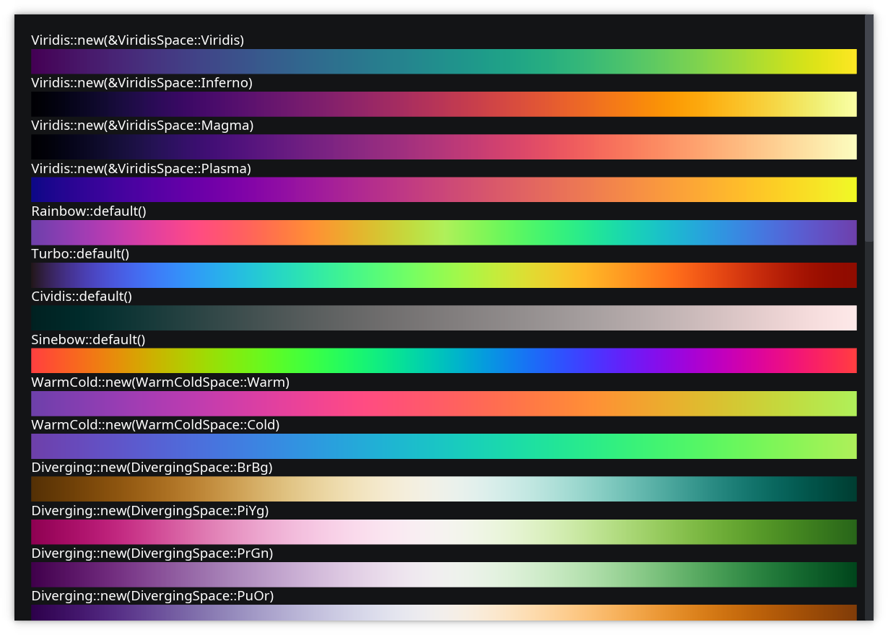
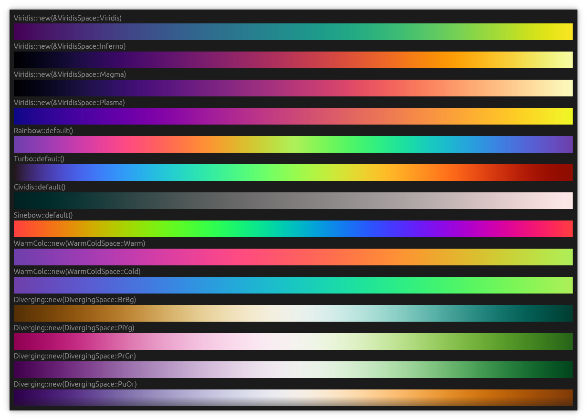

# vizkit - An agnostic kit for data visualization

|                           Iced                                  |                               Egui                              |
| --------------------------------------------------------------- | --------------------------------------------------------------- |
|  |  |

> [!WARNING]
> Under development

- Scaler (linear, logs, power, ordinal, band)
- Time Interval (day, month, year, hour, minute, second, millisecond)
- Color maps (warm, cold, viridis, diverging, sequential, rainbow, turbo, cividis, sinebow)
