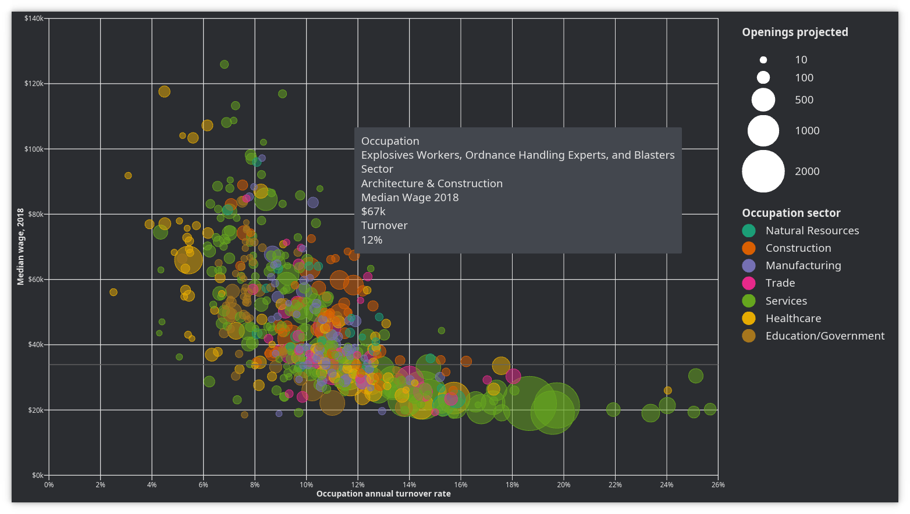
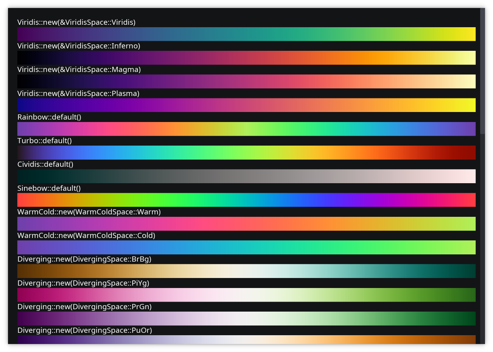
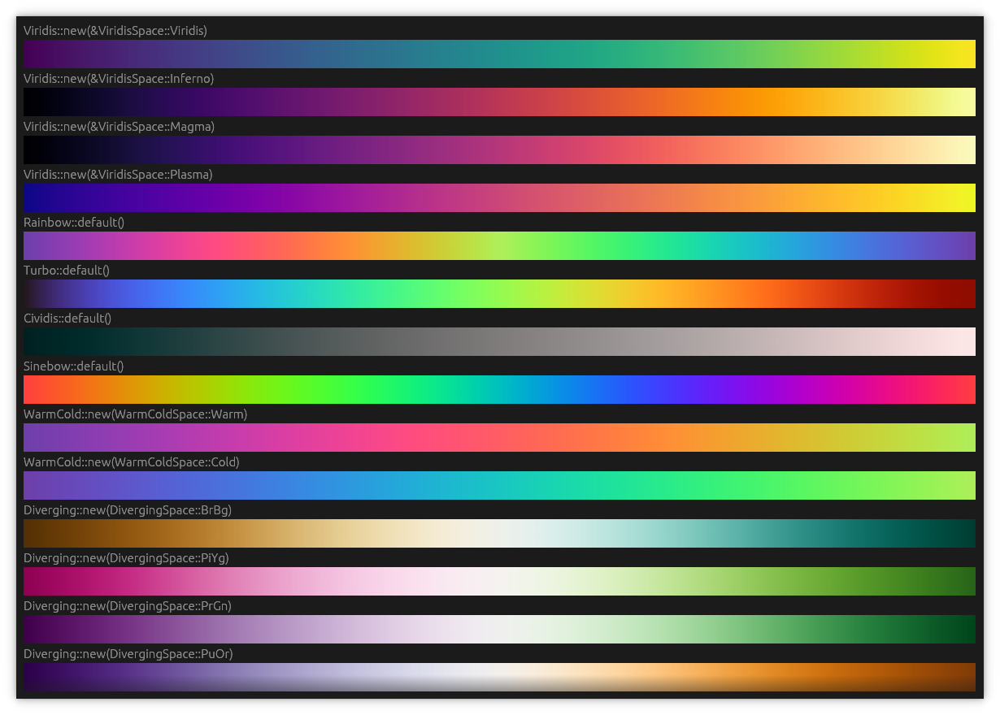

# vizkit - An agnostic kit for data visualization

It aims to provide basic functionalities for making easier data visualization in GUI such as [iced](https://iced.rs/) or [egui](https://www.egui.rs/) or more specific use cases such as creating your own SVG.

|                           Iced                                  |                               Egui                              |
| --------------------------------------------------------------- | --------------------------------------------------------------- |
|  |  |

## Crate features

Optional features:

- `time`: Enable time operations and scales with a temporal domain using [chrono](https://docs.rs/chrono/latest/chrono/).

## Alternatives

These alternatives are plotting libraries, meaning they are ready to use but do not offer as much freedom as positioning your elements yourself (text information, color gradients, arrows, ...).

- [plotters](https://docs.rs/plotters/latest/plotters/)
- [plotters-iced](https://github.com/Joylei/plotters-iced/)
- [egui_plot](https://github.com/emilk/egui_plot) - This is maybe an exception. The API is really flexible and allows you to draw what ever you want.

## License

- [MIT License](https://opensource.org/license/MIT)
